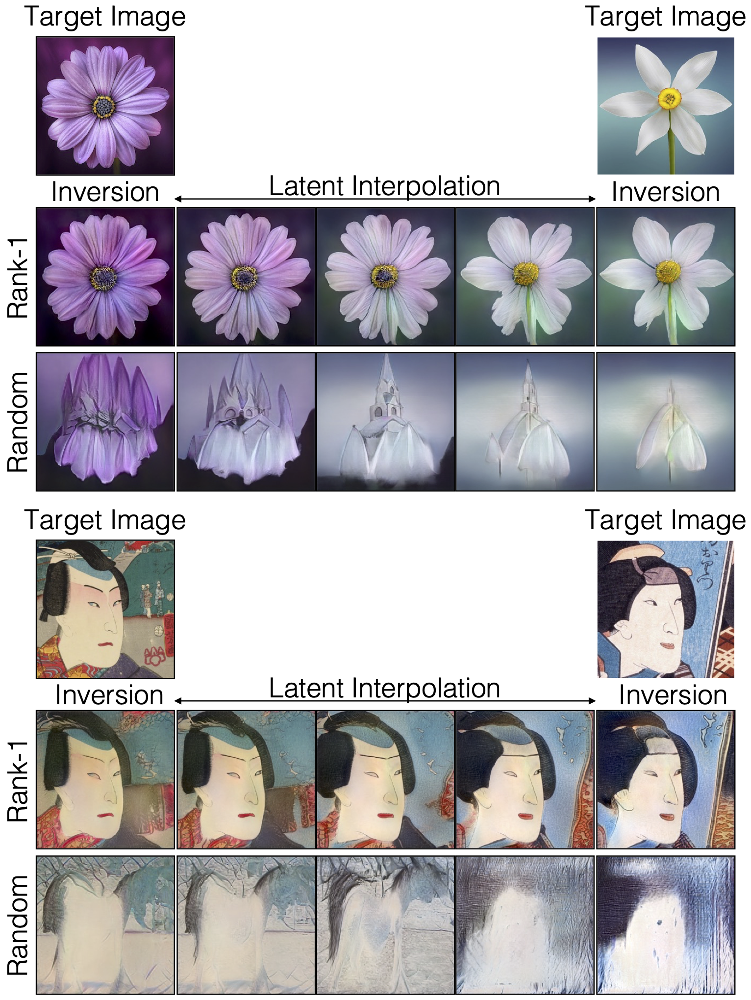
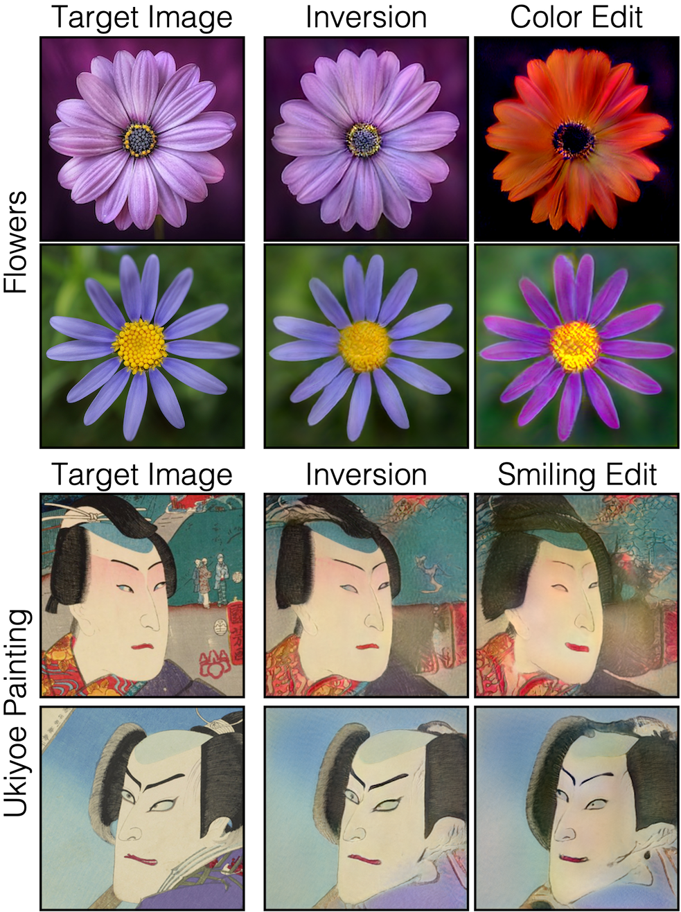

## Modelverse
 [**Website**](https://modelverse.cs.cmu.edu/) | [**Project**](https://generative-intelligence-lab.github.io/modelverse/) | [**Paper**](https://arxiv.org/abs/2210.03116) | [**Youtube**](https://youtu.be/smm0t81st_w)


https://user-images.githubusercontent.com/52025198/194438678-3cc767d0-5e6d-4ebc-b401-36d2a48d5f12.mov


We develop a content-based search engine for Modelverse, a model sharing platform that contains a diverse set of deep generative models, such as animals, landscapes, portraits, and art pieces. 
Through Modelverse, we introduce the problem of content-based model retrieval: given a query and a large set of generative models, finding the 
models that best match the query. We formulate the search problem as an optimization to maximize the probability of generating a query match given 
a model. We develop approximations to make this problem tractable when the query is an image, a sketch, a text description, another generative 
model, or a combination of these. 
<br><br><br>

[Daohan Lu](https://daohanlu.github.io)<sup>*1</sup>, [Sheng-Yu Wang](https://peterwang512.github.io/)<sup>*1</sup>, 
[Nupur Kumari](https://nupurkmr9.github.io/)<sup>*1</sup>, [Rohan Agarwal](https://rohana96.github.io/)<sup>*1</sup>, 
[David Bau](https://baulab.info/)<sup>2</sup>, 
[Jun-Yan Zhu](https://cs.cmu.edu/~junyanz)<sup>1</sup>.
<br> Carnegie Mellon University<sup>1</sup>, Northeastern University<sup>2</sup>

## Method

Our search system consists of a pre-caching stage and an inference stage. Given a collection of models, we first generate 50K samples for each model. We then encode the images into image features and compute the 1st and 2nd order feature statistics for each model. The statistics are cached in our system for efficiency. At inference time, we support queries of different modalities (text, image, or sketch). We encode the query into a feature vector, and assess the similarity between the query feature and each model’s statistics. The models with the best similarity measures are retrieved. We use pretrained CLIP model as the feature extractor for both images and text and show results with other feature extractor for images in our paper. 

<p align="center">

</p>


## Results

**Qualitative results of model retrieval**. Below we show model retrieval results with 3 different modalities - images, sketches, and text.

<p align="center">

</p>

Our method also enables multimodal queries (left) and using a model as a query to find similar models (right).

<p align="center">

</p>

**Image Reconstruction and Editing**. 
As the number of generative models grows, it is becoming increasingly infeasible for a user to know about every interesting model, and yet it can be crucial to choose the right model for their specific use. Below figure shows that selecting right generative model given a real image query results in better inversion and thereby better latent space interpolation and image-editing. 

<p align="center">


</p>


## Reference

If you find this useful for your research, please cite the following work.
```
@article{lu2022content,
  title={Content-Based Search for Deep Generative Models},
  author={Lu, Daohan and Wang, Sheng-Yu and Kumari, Nupur and Agarwal, Rohan and Bau, David and Zhu, Jun-Yan},
  journal = {arXiv preprint},
  month     = {October},
  year      = {2022}
}
```

Feel free to contact us with any comments or feedback.
