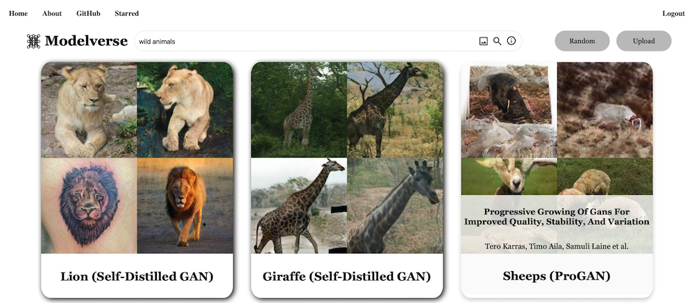
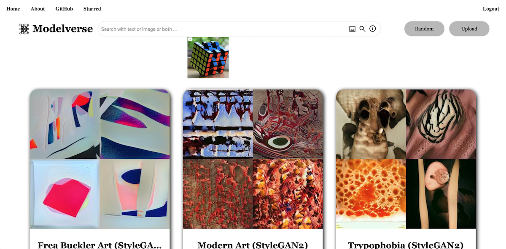
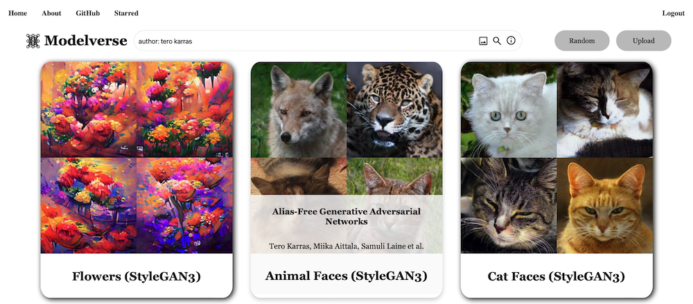
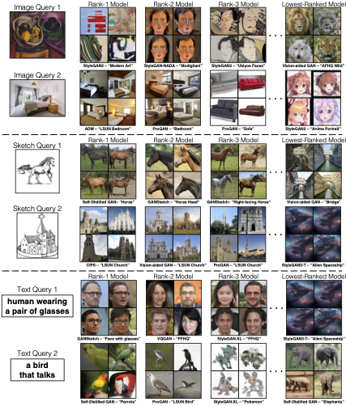
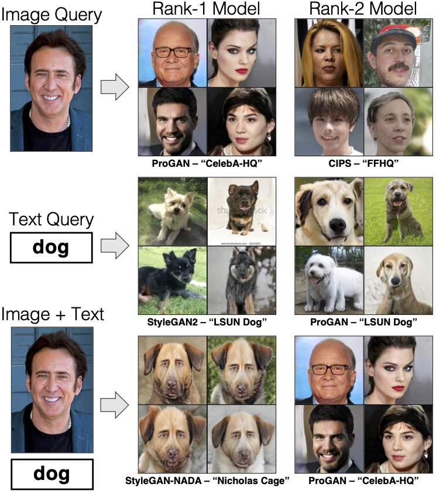

# Modelverse

 [**Website**](https://modelverse.cs.cmu.edu/) | [**Project**](https://generative-intelligence-lab.github.io/modelverse/) | [**Paper**](https://arxiv.org/abs/2210.03116) | [**Youtube**](https://youtu.be/smm0t81st_w) | [**Discord**](https://discord.gg/4ARdnzDD)

### The PyTorch code of model search algorithm will be coming soon!


 [Modelverse](https://modelverse.cs.cmu.edu/) is a model sharing and search platform that contains a diverse set of deep generative models such as GANs, diffusion models, and autoregressive models. This platform allows users to find, share, and study deep generative models more easily.<br>

<p align="center"> 
<b>Search by content demo</b>
</p>

<p align="center"> 

</p>

<p align="center"> 
<b>Search by title/author demo</b>
</p>

<p align="center"> 

</p>

Through Modelverse, we introduce the first content-based model search engine. Given a user query and a large set of generative models, we aim to the models that best match the query. The query could be an image, a sketch, a text description, another generative model, or a combination of these.
<br>

Content-Based Search for Deep Generative Models
<br>
[Daohan Lu](https://daohanlu.github.io)<sup>1*</sup>, [Sheng-Yu Wang](https://peterwang512.github.io/)<sup>1*</sup>,
[Nupur Kumari](https://nupurkmr9.github.io/)<sup>1*</sup>, [Rohan Agarwal](https://rohana96.github.io/)<sup>1*</sup>,
[David Bau](https://baulab.info/)<sup>2</sup>,
[Jun-Yan Zhu](https://cs.cmu.edu/~junyanz)<sup>1</sup>.
<br> Carnegie Mellon University<sup>1</sup>, Northeastern University<sup>2</sup>
<br>arXiv:2210.03116, 2022

## Getting Started 


- Search models via text queries: https://modelverse.cs.cmu.edu/?q=wild+animals
<p align="center"> 

</p>

- Search models via image queries.
<p align="center"> 

</p>


- Search models via paper title: https://modelverse.cs.cmu.edu/?q=title:anycost
<p align="center"> 

</p>


- Search models via author: https://modelverse.cs.cmu.edu/?q=author:+tero+karras
<p align="center"> 

</p>


## Method Overview

Our search system consists of a pre-caching stage and an inference stage. Given a collection of models, we first generate 50K samples for each model. We then encode the images into image features and compute the 1st and 2nd order feature statistics for each model. The statistics are cached in our system for efficiency. At inference time, we support queries of different modalities (text, image, or sketch). We encode the query into a CLIP feature vector, and assess the similarity between the query feature and each model’s statistics. The models with the best similarity measures are retrieved.

<p align="center">

</p>


## Search Results

**Qualitative results of model retrieval**. Below we show model retrieval results with three different modalities - images, sketches, and text.

<p align="center">

</p>

Our method also enables multimodal queries (left) and using a model as a query to find similar models (right).

<p align="center">

</p>


## Feedback
We are constantly improving our search engine and incorporating additional features to Modelverse. If you encounter issues of our current system or have interesting features in your mind, please reach out to us. You can either fill in the feedback [form](https://forms.gle/NvBcooZh1s5gDMG59) or join our [Discord](https://discord.gg/4ARdnzDD) discussion group.  Your feedback and suggestions will be greatly appreciated


## Reference

If you find this useful for your research, please cite the following work.
```
@article{lu2022content,
  title={Content-Based Search for Deep Generative Models},
  author={Lu, Daohan and Wang, Sheng-Yu and Kumari, Nupur and Agarwal, Rohan and Bau, David and Zhu, Jun-Yan},
  journal = {arXiv preprint arXiv:2210.03116},
  year      = {2022}
}
```
