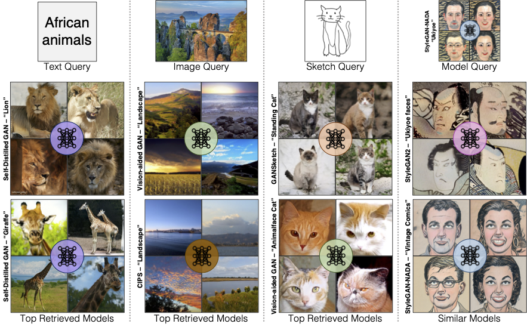
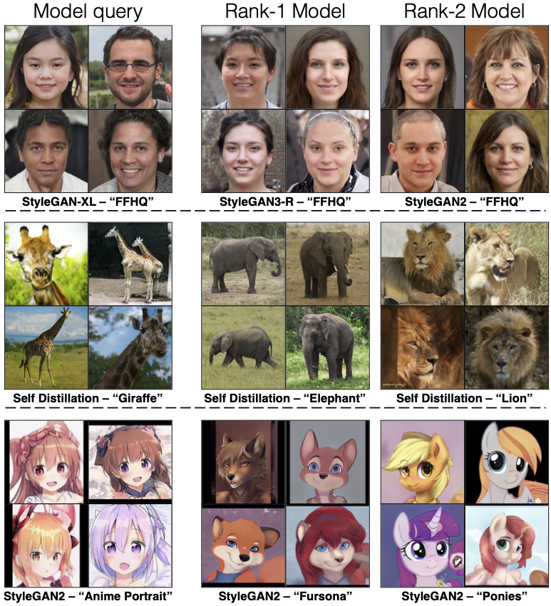
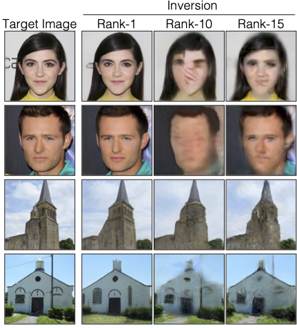

## Modelverse
 [**Project**](https://peterwang512.github.io/GANWarping/) | [**Paper**](https://arxiv.org/abs/2207.14288) | [**Youtube**](https://www.youtube.com/watch?v=2m7_rbsO6Hk) | [**Slides**](https://drive.google.com/file/d/10BD5-7WewE5ASyVqUUl65LopF8e5wJgZ/view)


<p align="center">
 
</p>


We develop a content-based search engine for Modelverse, a model sharing platform that contains a diverse set of deep generative models, such as animals, landscapes, portraits, and art pieces. 
Through Modelverse, we introduce the problem of content-based model retrieval: given a query and a large set of generative models, finding the 
models that best match the query. We formulate the search problem as an optimization to maximize the probability of generating a query match given 
a model. We develop approximations to make this problem tractable when the query is an image, a sketch, a text description, another generative 
model, or a combination of these. We demonstrate that our model search can retrieve good models for image editing and reconstruction, few-shot transfer learning, and latent space interpolation.
<br><br><br>

[Daohan Lu](https://daohanlu.github.io)<sup>*1</sup>, [Shengyu Wang](https://peterwang512.github.io/)<sup>*1</sup>, 
[Nupur Kumari](https://nupurkmr9.github.io/)<sup>*1</sup>, [Rohan Agarwal](https://rohana96.github.io/)<sup>*1</sup>, 
[David Bau](https://baulab.info/)<sup>2</sup>, 
[Jun-Yan Zhu](https://cs.cmu.edu/~junyanz)<sup>1</sup>.
<br> CMU<sup>1</sup>, Northeastern University<sup>2</sup>


## Results
**Qualitative results of model retrieval** Below we show model retrieval results with 3 different modalities - images, sketches, and text.

<p align="center">

</p>

Our method also enables multimodal queries and using a model as a query.

<p align="center">


</p>

**Image Reconstruction and Editing** Our method can also be applied to color edits. The colored strokes specify the locations to perform coloring 
changes, while the darker region defines the region to be preserved. The edited models produce precise coloring changes in the specified parts.  


<p align="center">



</p>


## Related Works


## Reference

If you find this useful for your research, please cite the following work.
```
```

Feel free to contact us with any comments or feedback.
